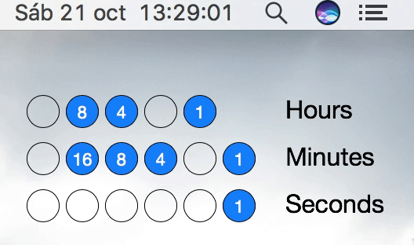

## Übersicht widget that displays a binary clock on the desktop

First of all I would like to thank [Felix](https://github.com/felixhageloh) for the great work on creating Übersicht and keeping on updated day after day.

**The widget**

**Installation**

1. Download **Übersicht** from the [official web page](http://tracesof.net/uebersicht/).
2. Unzip the download and open the **Übersicht.app** file. You should see a Getting Started widget in the center of your desktop.
3. Download this repo .zip file, unzip and put the uncompressed folder (removing the **-master** tag at the end of the folder name) in the following location `/Users/\<username>\/Library/Application Support/Übersicht/widgets`
4. Enjoy :)

   